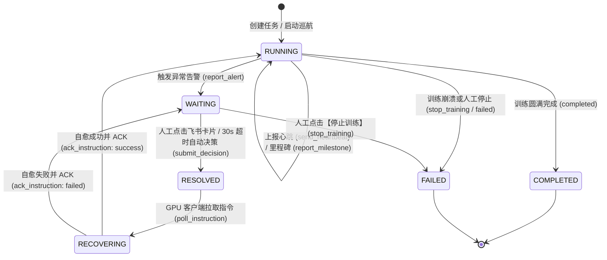

# TrainPilot: 深度学习训练集群的公网 MCP Server 与 HITL 闭环决策系统

<p align="center">
  
  
  
  
  
  
</p>

> 专为大规模深度学习分布式训练（PyTorch / DeepSpeed / Megatron-LM / Slurm / K8s）量身定制，采用 **“公网 MCP Server（Control Plane 网关） + 内网 GPU 客户端（Worker 主动连接 / 纯 Pull 模式）”** 的现代化解耦架构。

TrainPilot 彻底终结了内网 GPU 训练集群“无公网 IP”、“无法直接接收外网 Webhook”、“无外部凭据下发通道”与“训练异常难以及时干预”的痛点。通过标准 **Model Context Protocol (MCP)** 协议，打通训练异常捕获、现场就地冻结、飞书交互式卡片推送与**人类在回路（Human-In-The-Loop, HITL）**决策闭环，助力算法与运维团队实现秒级异常处置与智能自愈。

---

## 📑 目录

- [✨ 核心特性](#-核心特性)
- [🏛 系统架构与交互原理](#-系统架构与交互原理)
  - [网络拓扑架构](#网络拓扑架构)
  - [HITL 闭环时序与双向 ACK](#hitl-闭环时序与双向-ack)
  - [任务生命周期状态机](#任务生命周期状态机)
- [📂 项目结构](#-项目结构)
- [🚀 快速上手](#-快速上手)
  - [1. 安装与依赖同步](#1-安装与依赖同步)
  - [2. 服务端一键启停 (start.sh)](#2-服务端一键启停-startsh)
  - [3. 极速端到端模拟演练](#3-极速端到端模拟演练)
- [💻 客户端接入指南](#-客户端接入指南)
  - [方式一：PyTorch 训练主循环轻量守卫 (TrainingGuardian)](#方式一pytorch-训练主循环轻量守卫-trainingguardian)
  - [方式二：CUDA OOM 显存感知与自定义自愈 Handler](#方式二cuda-oom-显存感知与自定义自愈-handler)
  - [方式三：原生 MCP 客户端 (TrainPilotMCPClient)](#方式三原生-mcp-客户端-trainpilotmcpclient)
  - [方式四：GPU 节点命令行工具 (trainpilot-cli)](#方式四gpu-节点命令行工具-trainpilot-cli)
  - [方式五：外部 AI 智能体接入 (Claude Code / Cursor / OpenCode 等)](#方式五外部-ai-智能体接入-claude-code--cursor--opencode-等)
- [📡 MCP 核心接口契约](#-mcp-核心接口契约)
  - [MCP Tools (8 大标准工具)](#mcp-tools-8-大标准工具)
  - [MCP Resources (只读资源)](#mcp-resources-只读资源)
- [📱 飞书交互卡片与 HITL 闭环体系](#-飞书交互卡片与-hitl-闭环体系)
  - [5 类卡片矩阵](#5-类卡片矩阵)
  - [卡片防呆与幂等保障](#卡片防呆与幂等保障)
  - [飞书自建应用配置流程](#飞书自建应用配置流程)
- [💾 存储架构与失联看门狗](#-存储架构与失联看门狗)
  - [SQLite WAL 存储与冷热内存驱逐](#sqlite-wal-存储与冷热内存驱逐)
  - [失联看门狗 (Server Watchdog)](#失联看门狗-server-watchdog)
- [⚙️ 部署与环境配置速查](#️-部署与环境配置速查)
  - [启动脚本高级参数](#启动脚本高级参数)
  - [Docker 容器化部署](#docker-容器化部署)
  - [环境变量完全参考表](#环境变量完全参考表)
- [🧪 自动化测试](#-自动化测试)
- [📄 开源协议](#-开源协议)

---

## ✨ 核心特性

- 🌐 **MCP 原生标准协议驱动**：基于 Model Context Protocol (MCP) 2.x 最新 **Streamable HTTP** 规范暴露 `/mcp` 端点，任何兼容 MCP 的外部智能体（Claude Code、Cursor、Gemini CLI 等）开箱即用，无需在本地编写或安装定制 Skills 脚本。
- 🪶 **内网 GPU 节点纯客户端**：内网 GPU 集群（NAT/防火墙后）不需要公网 IP，不开放任何入站端口，无需存储飞书 App Secret 等敏感凭据，只需以客户端身份主动连接公网控制面。
- 🛡️ **浮点安全与数值免疫**：内置递归浮点清洗模块，自动处理 PyTorch Tensor、NumPy Scalar/Array、Python Decimal 以及 `NaN`、`Inf`、`-Inf`，保证 JSON 序列化 100% 安全，杜绝因数值发散导致的进程崩溃。
- 🔄 **严格双向 ACK 与自愈闭环**：基于 `RUNNING -> WAITING -> RESOLVED -> RECOVERING -> RUNNING` 的可靠状态机，客户端完成自愈后在 ACK 中上报 `solution` 方案，控制面原子流转状态并自动下发飞书【自愈恢复】卡片。
- ⚡ **服务端长轮询毫秒唤醒**：客户端拉取指令支持服务端长连接挂起（默认 20s），一旦人类决策提交或超时决策触发，毫秒级唤醒下发，空轮询网络开销直降 90% 以上。
- ⏱️ **单点超时自动兜底**：异常告警触发后，支持飞书端专家人工干预；若在设定窗口（默认 30s）内无人响应，控制面统一判定自动自愈（如 `self_resolve`），消除分布式抢跑与死锁。
- 📱 **飞书卡片防呆防误触**：Webhook 3 秒内即刻响应，用户点击后立即就地回写卡片为【已处理】状态并收起按钮，阻断团队多人并发误触与请求重放。
- 🤖 **Agent 智能点评原生支持**：上报里程碑或告警时，支持附带 AI 智能体针对收敛趋势、调优方向的 `agent_note` 自主研判分析，卡片独立分区呈现。
- 💾 **SQLite WAL 持久化与极低内存**：零外部数据库依赖，全事件落盘存储；支持冷热数据分离，终态任务自动从 RAM 驱逐，具备磁盘增量压缩与历史自动修剪，小规格云服务器（如 1C1G/1C2G）即可平稳运行。
- 🐕 **失联看门狗 (Watchdog)**：服务端常驻守护巡检线程，实时扫描心跳中断的任务（防范节点硬件断电、Slurm 杀进程、NCCL 通信死锁），主动向飞书推送失联预警卡片并自动防抖。

---

## 🏛 系统架构与交互原理

### 网络拓扑架构

```text
┌────────────────────────────────────────────────────────┐
│               内网 GPU 训练集群 (私网 / NAT)             │
│                                                        │
│  ┌───────────────────────┐   ┌──────────────────────┐  │
│  │   GPU 节点 01 (PyTorch) │   │  GPU 节点 02 (DeepSpeed)│  │
│  │  ┌──────────────────┐ │   │  ┌─────────────────┐ │  │
│  │  │ TrainingGuardian │ │   │  │  trainpilot-cli │ │  │
│  │  └────────┬─────────┘ │   │  └────────┬────────┘ │  │
│  │           │           │   │           │          │  │
│  │  ┌────────▼─────────┐ │   │  ┌────────▼────────┐ │  │
│  │  │ TrainPilotClient │ │   │  │ TrainPilotMCP...│ │  │
│  │  └────────┬─────────┘ │   │  └────────┬────────┘ │  │
└──────────────┼───────────────────────────┼─────────────┘
               │  出站主动连接 (HTTP / /mcp)   │  (无须公网 IP)
               ▼                           ▼
┌────────────────────────────────────────────────────────┐
│             公网云服务器 (Control Plane Gateway)        │
│                                                        │
│  ┌──────────────────────────────────────────────────┐  │
│  │ FastAPI + MCP Server (/mcp Streamable HTTP)      │  │
│  ├──────────────────────────────────────────────────┤  │
│  │ • Mailbox 任务信箱与长轮询挂起调度器              │  │
│  │ • 任务生命周期状态机 (RUNNING/WAITING/RESOLVED...) │  │
│  │ • 浮点安全转换器 (_sanitize_for_json)             │  │
│  │ • SQLite WAL 存储引擎 (本地持久化与冷热驱逐)       │  │
│  │ • Watchdog 任务失联守护看门狗                     │  │
│  └───────────────────────┬──────────────────────────┘  │
└──────────────────────────┼─────────────────────────────┘
                           │ 飞书 Webhook 交互
                           ▼
┌────────────────────────────────────────────────────────┐
│               移动端 / 桌面端 飞书客户端                 │
│                                                        │
│   👨‍💻 人类专家 (HITL) ── 收到异常卡片 ──> 一键决策处置    │
│   🤖 算法团队 ─────────> 查阅 Agent 智能点评与自愈报告    │
└────────────────────────────────────────────────────────┘
```

### HITL 闭环时序与双向 ACK

```text
[ 内网 GPU 客户端 ]               [ 公网控制面 Gateway ]            [ 飞书互动卡片 ]
        │                                  │                              │
        │─── 1. report_alert (Loss NaN) ──►│                              │
        │    (训练就地挂起，等待指令)       │─── 2. 推送红色交互告警卡片 ─►│
        │                                  │        (展示指标/带操作按钮) │
        │                                  │                              │
        │─── 3. poll_instruction(wait) ───►│ (挂起长连接，等待决策)       │
        │                                  │                              │
        │                                  │◄── 4. 点击【自行解决】 ──────│ (人工点击)
        │                                  │    (或 30s 超时自动决策)     │ (卡片就地防呆变灰)
        │                                  │                              │
        │◄── 5. 毫秒级唤醒返回指令 ─────────┤ (返回 action: self_resolve)  │
        │                                  │                              │
  执行自愈措施 (回退ckpt/重置优化器)        │                              │
        │                                  │                              │
        │─── 6. ack_instruction ──────────►│ (校验指令ID，流转回 RUNNING) │
        │      (携带 solution 方案)        │─── 7. 推送【自愈成功】卡片 ──►│
        │                                  │                              │ (告知团队已自愈)
        │ 恢复正常迭代训练                 │                              │
        │─── 8. report_milestone ─────────►│─── 9. 推送绿色里程碑卡片 ────►│
        │      (携带 Agent 智能点评)       │                              │ (展示 AI 趋势研判)
```

### 任务生命周期状态机



---

## 📂 项目结构

```text
TrainPilot/
├── src/trainpilot/
│   ├── common/                  # 数据契约与公共基础模块
│   │   ├── gateway.py           # 统一网关与客户端地址智能解析
│   │   ├── schemas.py           # Pydantic 核心数据模型 (请求/响应/卡片载荷)
│   │   └── states.py            # 任务状态机枚举 (TaskState, EventType, ActionType)
│   ├── server/                  # 公网控制面与 MCP Server
│   │   ├── main.py              # FastAPI 入口，挂载 /mcp Streamable HTTP 协议
│   │   ├── mcp_server.py        # 标准 MCP Server (8 个 Tools + 2 个 Resources)
│   │   ├── mailbox.py           # TaskMailboxManager 线程安全调度与长轮询核心
│   │   ├── storage.py           # SQLite WAL 持久化存储与冷热数据修剪引擎
│   │   ├── watchdog.py          # 失联看门狗守护线程 (心跳异常检测与防抖)
│   │   ├── auth.py              # API Token 鉴权依赖 (Bearer / X-API-Token)
│   │   ├── config.py            # 基于 pydantic-settings 的集中配置中心
│   │   ├── routes/
│   │   │   ├── tasks.py         # RESTful 任务上报、长轮询与控制接口
│   │   │   └── webhook.py       # 飞书 URL 验证与卡片交互回调处理
│   │   └── feishu/
│   │       ├── cards.py         # 5 类飞书交互式与富文本卡片 JSON 构建器
│   │       └── client.py        # 飞书官方 SDK 通信与 Mock 双模客户端
│   └── agent/                   # 内网 GPU 训练节点客户端
│       ├── client.py            # TrainPilotClient (纯标准库+requests的轻量客户端)
│       ├── mcp_client.py        # TrainPilotMCPClient (原生 MCP Streamable 客户端)
│       ├── monitor.py           # TrainingGuardian (PyTorch 训练守卫与自愈拦截器)
│       └── cli.py               # trainpilot-cli 命令行工具 (内置 9 大子命令)
├── examples/                    # 示例程序
│   ├── mock_training.py         # 端到端无 GPU 纯模拟训练与自愈演示
│   ├── real_gpu_training.py     # 真实 PyTorch GPU 训练与异常拦截范例
│   └── run_server.py            # 便捷启动控制面服务的 Python 脚本
├── tests/                       # 自动化测试套件 (56 项单元与集成测试)
├── Dockerfile                   # 容器化镜像构建规范
├── start.sh                     # 服务端控制台管理脚本 (前台/守护/状态/停止)
├── pyproject.toml               # 项目元数据与依赖定义 (uv/pip)
└── .env.example                 # 环境变量模板 (服务端与客户端双模块)
```

---

## 🚀 快速上手

本项目推荐使用现代高性能 Python 包管理工具 [uv](https://docs.astral.sh/uv/)。

### 1. 安装与依赖同步

```bash
# 克隆仓库
git clone https://github.com/Long-Holiday/TrainPilot.git
cd TrainPilot

# 安装依赖 (生产环境如需推送真实飞书卡片，建议同步完整依赖)
uv sync
```

### 2. 服务端一键启停 (`start.sh`)

项目根目录提供了功能齐备的运维管理脚本 [`start.sh`](file:///home/default_user/TrainPilot/start.sh)，自动处理环境检测、端口可用性排查与进程托管：

```bash
# 1. 前台交互式启动 (调试与查看实时日志)
./start.sh

# 2. 后台守护进程模式启动 (生产部署推荐)
./start.sh --daemon

# 3. 查看当前服务运行状态与健康检查探针
./start.sh --status

# 4. 优雅停止后台服务
./start.sh --stop

# 5. 自定义端口与绑定地址启动
./start.sh -p 28780 --host 0.0.0.0
```

服务启动后，终端将输出如下关键端点：
- **MCP 服务端点**: `http://<公网IP>:28780/mcp` (Streamable HTTP 传输)
- **API 交互文档**: `http://<公网IP>:28780/docs` (Swagger UI)
- **健康检查探针**: `http://<公网IP>:28780/health`
- **飞书事件回调**: `http://<公网IP>:28780/webhook/feishu`

### 3. 极速端到端模拟演练

无需真实 GPU 即可在本地完整验证 **异常告警 -> 飞书卡片 -> 人工/超时决策 -> 现场恢复 -> 闭环 ACK** 的全流程：

```bash
# 启动模拟训练（默认自动连接本地 28780 端口，模拟在第 6 步触发 NaN 并在 3 秒后闭环自愈）
uv run python examples/mock_training.py
```

---

## 💻 客户端接入指南

### 方式一：PyTorch 训练主循环轻量守卫 (`TrainingGuardian`)

在 GPU 节点的训练代码中，只需通过 `TrainingGuardian` 包装 Loss 校验。当发生 `NaN`、`Inf` 或剧烈突增时，训练自动就地冻结，待人工确认或自愈成功后无缝继续：

```python
import torch
from trainpilot.agent import (
    TrainPilotClient,
    TrainingGuardian,
    StopTrainingException,
)

# 1. 初始化客户端 (指定公网服务器地址与当前任务标识)
client = TrainPilotClient(
    gateway_url="http://<公网服务器IP>:28780",
    task_id="llama3-8b-sft",
    api_token="your_optional_api_token",  # 若服务端开启了 TRAINPILOT_API_TOKEN
)

# 2. 初始化训练守卫
guardian = TrainingGuardian(client=client)

try:
    for epoch in range(num_epochs):
        for step, batch in enumerate(dataloader):
            optimizer.zero_grad()
            outputs = model(**batch)
            loss = outputs.loss
            
            # 核心拦截：检测 NaN/Inf/突增 -> 冻结现场 -> 飞书告警 -> 等待决策 -> 自动恢复 -> ACK 闭环
            guardian.check_and_handle_loss(loss.item(), step=step, epoch=epoch)
            
            loss.backward()
            optimizer.step()

            # 阶段性上报里程碑 (支持外部 Agent 智能点评)
            if step % 500 == 0:
                client.notify_milestone(
                    message=f"Step {step} 迭代正常，权重梯度平稳",
                    step=step,
                    epoch=epoch,
                    metrics={"loss": round(loss.item(), 4)},
                    agent_note="收敛速率符合预期，建议维持当前学习率与 Warmup 策略。",
                )
except StopTrainingException:
    print("🛑 收到飞书人工决策【停止训练】，执行紧急安全 Checkpoint 存档并退出。")
    save_emergency_checkpoint(model)
```

---

### 方式二：CUDA OOM 显存感知与自定义自愈 Handler

`TrainingGuardian` 提供了便捷的显存溢出（OOM）捕获与自定义动作处理器注册机制：

```python
guardian = TrainingGuardian(client=client)

# 自定义【自行解决】动作的恢复逻辑
def custom_recovery_handler(payload):
    print("正在执行自愈：清空显存缓存并回退至上一步 Checkpoint...")
    torch.cuda.empty_cache()
    model.load_state_dict(torch.load("latest_checkpoint.pt"))
    optimizer.param_groups[0]["lr"] *= 0.5
    # 返回明确的方案描述，该描述将自动呈现在飞书【自愈恢复】卡片中
    return "已清空显存并回退 Checkpoint，学习率衰减 50% 后恢复训练"

guardian.register_action_handler("self_resolve", custom_recovery_handler)

# 在训练捕获中使用
try:
    loss.backward()
except torch.cuda.OutOfMemoryError:
    # 自动采集显存分配与保留指标并上报至控制面冻结现场
    guardian.handle_oom(step=step, epoch=epoch)
```

---

### 方式三：原生 MCP 客户端 (`TrainPilotMCPClient`)

如果需要在 Python 进程中直接使用 MCP 协议规范与服务端交互，可使用 `TrainPilotMCPClient`（原生支持 Async 与 Sync 两种调用风格，且与 `TrainingGuardian` 鸭子类型完全兼容）：

```python
from trainpilot.agent import TrainPilotMCPClient, TrainingGuardian

# 原生基于 Streamable HTTP 协议连接 /mcp 端点
mcp_client = TrainPilotMCPClient(
    server_url="http://<公网服务器IP>:28780",
    task_id="qwen2-7b-pretrain",
)

# 列出服务端暴露的所有工具
tools = mcp_client.list_tools()
print(f"服务端支持的工具: {tools}")

# 上报里程碑
mcp_client.report_milestone(
    message="Epoch 2 顺利结束",
    step=20000,
    metrics={"loss": 0.28, "val_loss": 0.31},
    agent_note="泛化能力良好，未发现过拟合迹象。",
)

# 传入 Guardian 中使用（完全替代 HTTP Client）
guardian = TrainingGuardian(client=mcp_client)
```

---

### 方式四：GPU 节点命令行工具 (`trainpilot-cli`)

适用于 Shell 脚本、Slurm 作业脚本 (`sbatch`) 或独立运维控制台，开箱即用：

```bash
# 环境变量配置 (建议写入 ~/.bashrc 或作业脚本)
export TRAINPILOT_GATEWAY_URL="http://<公网服务器IP>:28780"
export TRAINPILOT_TASK_ID="slurm-job-9527"

# 1. 查看公网服务端所有可用 MCP 工具
uv run trainpilot-cli list-tools

# 2. 上报训练阶段里程碑 (飞书绿色卡片 + Agent 智能点评)
uv run trainpilot-cli report-milestone \
  --step 5000 --epoch 1 --metrics "loss=0.385,gpu_mem=82%" \
  --message "第一阶段预热完成" \
  --agent-note "学习率已达峰值，梯度范数正常，可继续推进。"

# 3. 异常主动告警并冻结训练现场 (飞书红色交互卡片)
uv run trainpilot-cli report-alert \
  --step 5420 --metrics "loss=NaN" \
  --message "检测到 Loss 突变为 NaN" \
  --agent-note "怀疑由于特定 Batch 异常长文本引起梯度溢出。"

# 4. 阻塞长轮询信箱，等待专家或系统决策 (毫秒级唤醒)
uv run trainpilot-cli poll-instruction --wait --wait-timeout 30

# 5. 执行恢复方案后上报 ACK 确认 (状态流转回 RUNNING 并推送自愈卡片)
uv run trainpilot-cli ack-instruction \
  --action self_resolve --status success \
  --solution "已丢弃脏数据样本，并重置优化器动量"

# 6. 发送 GPU 节点健康心跳 (供 Watchdog 看门狗巡检)
uv run trainpilot-cli send-heartbeat --step 5500 --metrics "gpu_util=98%"

# 7. 查看指定任务当前状态及未决指令
uv run trainpilot-cli get-status

# 8. 查看集群所有跟踪任务
uv run trainpilot-cli list-tasks --limit 20
```

---

### 方式五：外部 AI 智能体接入 (Claude Code / Cursor / OpenCode 等)

任何支持 **Model Context Protocol (MCP)** 的现代编程助手或自主 Agent，只需配置公网 MCP Server 地址，即可无需编写代码直接在对话中巡检训练、下发决策与研判指标。

在对应客户端的 MCP 配置文件（如 `~/.claude.json`、Cursor MCP 配置或 Claude Desktop 设定）中追加：

```json
{
  "mcpServers": {
    "trainpilot": {
      "url": "http://<公网服务器IP>:28780/mcp"
    }
  }
}
```

配置完成后，Agent 在对话上下文中将直接获得所有 TrainPilot 训练控制与状态查询能力，例如向 Agent 提问：
- *“查看当前正在运行的训练任务状态”* -> Agent 自动调用 `list_tasks` 或读取 `tasks://list`
- *“给 llama3-8b 任务下发自行解决指令”* -> Agent 自动调用 `submit_decision`
- *“帮我分析当前损失并上报一个里程碑”* -> Agent 自动调用 `report_milestone` 附带分析点评

---

## 📡 MCP 核心接口契约

公网控制面严格遵循 MCP 规范，对外提供标准化 **Tools** 与 **Resources**。

### MCP Tools (8 大标准工具)

| 工具名称 (Tool Name) | 核心职责 | 输入参数摘要 | 输出及行为效果 |
|:---|:---|:---|:---|
| **`report_milestone`** | 监控上报 | `task_id`, `message`, `step`, `epoch`, `metrics`, `agent_note`, `extra` | 记录里程碑，更新步数与指标，向飞书推送绿色卡片及 Agent 点评 |
| **`report_alert`** | 异常拦截 | `task_id`, `message`, `step`, `epoch`, `metrics`, `agent_note`, `extra` | 状态置为 `WAITING`，冻结训练，推送红色交互卡片，激活 30s 超时定时器 |
| **`poll_instruction`** | HITL 决策拉取 | `task_id`, `wait_timeout` (默认20s), `pop` (默认True) | 挂起等待决策；决策到达时返回指令并将状态流转至 `RECOVERING` |
| **`ack_instruction`** | 自愈确认 | `task_id`, `instruction_id`, `action`, `status`, `solution`, `message` | 校验指令有效性，状态流转回 `RUNNING`，异步推送飞书【自愈恢复】卡片 |
| **`send_heartbeat`** | 节点保活 | `task_id`, `step`, `epoch`, `metrics`, `status` | 更新 `last_heartbeat_at`，重置失联预警标记，向看门狗报到 |
| **`get_task_status`** | 状态查询 | `task_id` | 获取指定任务当前生命周期状态、最新指标、信箱未决指令与事件统计 |
| **`list_tasks`** | 集群汇总 | `limit`, `offset`, `state` (状态过滤), `stale_only` (仅失联) | 分页查询集群所有跟踪任务列表，支持失联与状态过滤 |
| **`submit_decision`** | 控制台干预 | `task_id`, `action`, `payload`, `operator` | 运维人员或测试直接注入决策，更新信箱并就地将飞书卡片置为已处理 |

### MCP Resources (只读资源)

除了可调用的 Tools，TrainPilot 还向 MCP 客户端暴露如下标准资源：

| 资源 URI (Resource URI) | MIME 类型 | 功能描述 |
|:---|:---|:---|
| **`tasks://status/{task_id}`** | `application/json` | 以 JSON 格式读取指定任务的完整状态快照（包含信箱与事件统计） |
| **`tasks://list`** | `application/json` | 以 JSON 格式读取当前所有跟踪训练任务的简明摘要列表 |

---

## 📱 飞书交互卡片与 HITL 闭环体系

### 5 类卡片矩阵

TrainPilot 为深度学习生命周期的不同场景精心设计了视觉分明、结构规整的飞书卡片：

| 卡片类型 | 视觉色系 | 触发时机 | 核心内容与交互要素 |
|:---|:---:|:---|:---|
| **⚠️ 训练异常告警卡片** | 🔴 红色 Header | 触发 `report_alert` (如 Loss NaN、突增) | 实时指标、异常详情、**🤖 Agent 异常研判**、30s 倒计时说明；提供【🛑 停止训练】与【✅ 自行解决】两个交互按钮 |
| **🚀 训练里程碑卡片** | 🟢 绿色 Header | 触发 `report_milestone` (如 Epoch 完成) | 阶段进度、关键指标、**🤖 Agent 智能点评**（独立区块呈现模型调优意见） |
| **✅ 决策闭环防呆卡片** | 🟦 绿松石 Header | 用户点击决策按钮或 30s 超时触发 | 就地替换原告警卡片，展示**决策人**、**选定动作**及**闭环时间**；完全隐藏按钮防呆 |
| **🛠️ 异常自愈成功卡片** | 🟢 绿色 Header | 客户端执行自愈后发送 `ack_instruction` | 展示执行的解决方法概要（如回退 Checkpoint、调小学习率），告知团队训练已复苏 |
| **⚠️ 训练失联预警卡片** | 🟠 橙色 Header | Watchdog 检测到心跳超时（默认 >300s） | 失联时长、最后已知步数与心跳时间，提示排查硬件断电、节点崩溃或 NCCL 死锁 |

### 卡片防呆与幂等保障

1. **就地回写替换**：飞书用户在手机或 PC 端点击按钮后，服务端响应中直接携带 `type: "raw"` 的新卡片，飞书客户端 3 秒内将原告警卡片更新为【决策已闭环】，彻底移除操作按钮，防止并发环境下多人重复点击。
2. **状态机强锁保护**：即使网络抖动产生重放请求，一旦任务脱离 `WAITING` 状态，控制面将拒绝后续的重复决策；客户端 ACK 时也必须携带匹配的 `instruction_id`。

### 飞书自建应用配置流程

如需启用真实的飞书卡片推送与交互，只需在[飞书开放平台](https://open.feishu.cn/)创建企业自建应用：

1. **凭证获取**：进入应用详情页，在【凭证与基础信息】中获取 `App ID` 和 `App Secret`。
2. **事件订阅与回调配置**：
   - 请求网址 URL 填写：`http://<公网服务器IP>:28780/webhook/feishu`
   - 获取并配置 `Verification Token` 与 `Encrypt Key`（可选）。
3. **卡片行为回调配置**：
   - 在【应用功能】->【机器人】中启用机器人能力。
   - 在【消息与群组】或卡片交互配置中，将消息卡片交互回调 URL 同样配置为 `http://<公网服务器IP>:28780/webhook/feishu`。
4. **权限范围 (Scope)**：
   - 勾选 `im:message`（获取与发送单聊/群聊消息）相关读写权限。
5. **获取接收目标 ID**：
   - 群聊推送：将机器人拉入训练监控群，在群设置中获取 `chat_id`（如 `oc_xxxx`）。
   - 个人推送：获取用户的 `open_id`（如 `ou_xxxx`）。

> [!NOTE]
> 若尚未配置飞书应用，系统默认开启安全 Mock 模式：所有卡片均会在服务端控制台以格式化日志完整打印，绝不阻断训练流程或测试执行。

---

## 💾 存储架构与失联看门狗

### SQLite WAL 存储与冷热内存驱逐

TrainPilot 采用专门针对边缘与低配服务器调优的轻量存储架构：
- **WAL 模式与事务隔离**：启动时执行 `PRAGMA journal_mode=WAL; PRAGMA synchronous=NORMAL;`，实现高并发读写互不阻塞。
- **冷热数据分离与内存释放**：
  - 内存仅常驻处于活跃状态（`RUNNING`、`WAITING`、`RECOVERING`）的任务；
  - 一旦任务进入终态（`COMPLETED`、`FAILED`），自动从 RAM 中驱逐，释放 Python 进程内存；
  - 历史任务查询直接走 SQLite 分页 (`LIMIT / OFFSET`)，保证无论累积多少万条记录，内存占用均恒定在 50MB 以内。
- **环形事件修剪与磁盘压缩**：单任务事件超过 `TRAINPILOT_MAX_EVENTS_PER_TASK`（默认 500 条）时自动裁剪旧记录，看门狗后台定期执行 `PRAGMA incremental_vacuum` 与 `wal_checkpoint(TRUNCATE)`，避免磁盘膨胀。

### 失联看门狗 (`Server Watchdog`)

在多机多卡分布式训练中，节点由于硬件过热死机、CUDA 驱动异常崩溃或 NCCL 通信挂死并不少见：
1. **静默周期扫描**：后台守护线程以可配置周期（默认 15s）巡检所有非终态任务。
2. **阈值判定**：若当前时间与 `last_heartbeat_at` 差值超过 `TRAINPILOT_TASK_HEARTBEAT_TIMEOUT_SECONDS`（默认 300s），判定为失联。
3. **状态持久化防抖**：在 SQLite 的 `stale_alerted` 字段中打标防抖，**同一失联周期只推送一次报警**，杜绝卡片刷屏；当节点恢复心跳后自动解禁防抖。
4. **生命周期自动回收**：自动清理 7 天前已结束的历史终态任务。

---

## ⚙️ 部署与环境配置速查

### 启动脚本高级参数

[`start.sh`](file:///home/default_user/TrainPilot/start.sh) 提供了完善的命令行参数：

```text
用法: ./start.sh [选项]

选项:
  (无参数)                 前台交互式启动控制面网关 (默认)
  --daemon, -d             后台守护进程模式启动 (通过 nohup/setsid 托管)
  --stop                   优雅停止运行中的后台网关进程
  --status                 检查服务存活状态并调用 /health 探针
  --port, -p <PORT>        临时指定监听端口 (默认: 28780)
  --host, --bind, -H <IP>  临时指定绑定网卡地址 (默认: 0.0.0.0)
  --help, -h               查看帮助信息
```

### Docker 容器化部署

本项目提供了优化的多阶段轻量 Dockerfile（基于 `python:3.11-slim` 与 `uv`）：

```bash
# 1. 构建镜像
docker build -t trainpilot:latest .

# 2. 运行容器 (映射 28780 端口，挂载持久化数据库与配置文件)
docker run -d \
  --name trainpilot-gateway \
  -p 28780:28780 \
  -v $(pwd)/trainpilot.db:/app/trainpilot.db \
  -v $(pwd)/.env:/app/.env:ro \
  --restart always \
  trainpilot:latest
```

> [!WARNING]
> **关于并发 Worker 的重要说明**：由于控制面内部维护了内存信箱调度器与毫秒级长轮询事件挂起机制，Uvicorn **必须以单 Worker 模式运行**（`--workers 1`）。切勿使用多 Worker 进程，否则跨进程将无法共享长轮询等待锁。如需水平扩展，请通过统一网关反向代理并基于 `task_id` 实现哈希路由。

### 环境变量完全参考表

复制并编辑配置文件：`cp .env.example .env`

#### 模块一：公网服务端配置 (运行在公网服务器)

| 环境变量名 | 默认值 | 类型 | 配置说明 |
|:---|:---|:---:|:---|
| `TRAINPILOT_PORT` | `28780` | int | 服务端监听端口（采用高位端口规避冲突） |
| `TRAINPILOT_BIND_HOST` | `0.0.0.0` | str | 服务端绑定网卡地址（优先使用） |
| `TRAINPILOT_DEBUG` | `false` | bool | 是否启用调试级别日志 |
| `TRAINPILOT_FEISHU_APP_ID` | - | str | 飞书应用凭据 App ID (`cli_xxxx`) |
| `TRAINPILOT_FEISHU_APP_SECRET` | - | str | 飞书应用凭据 App Secret |
| `TRAINPILOT_FEISHU_VERIFICATION_TOKEN` | - | str | 飞书 Webhook 事件校验 Token |
| `TRAINPILOT_FEISHU_ENCRYPT_KEY` | - | str | 飞书 Webhook 消息加密密钥（可选） |
| `TRAINPILOT_FEISHU_RECEIVE_ID_TYPE` | `chat_id` | str | 接收者类型 (`chat_id`, `open_id`, `user_id`, `email`) |
| `TRAINPILOT_FEISHU_RECEIVER_ID` | - | str | 接收者 ID（群聊 `oc_xxxx` 或个人 `ou_xxxx`） |
| `TRAINPILOT_ENABLE_MOCK_FEISHU` | `false` | bool | 强制启用飞书 Mock 模式（测试与本地演练用） |
| `TRAINPILOT_API_TOKEN` | - | str | API 鉴权令牌（设置后客户端调用须携带此 Token） |
| `TRAINPILOT_ALERT_DECISION_TIMEOUT_SECONDS`| `30` | int | 告警卡片等待人工决策超时时间（秒），超时自动自愈 |
| `TRAINPILOT_TASK_HEARTBEAT_TIMEOUT_SECONDS`| `300` | int | 任务心跳判定失联阈值（秒） |
| `TRAINPILOT_LONG_POLL_TIMEOUT_SECONDS` | `20.0` | float | 服务端长轮询最大挂起时长（秒） |
| `TRAINPILOT_ENABLE_SQLITE` | `true` | bool | 是否启用 SQLite WAL 本地持久化 |
| `TRAINPILOT_SQLITE_PATH` | `trainpilot.db` | str | SQLite 数据库存储路径 |
| `TRAINPILOT_MAX_EVENTS_PER_TASK` | `500` | int | 每个任务保留的最大历史事件数量（环形修剪） |
| `TRAINPILOT_ENABLE_WATCHDOG` | `true` | bool | 是否启用服务端失联看门狗守护线程 |
| `TRAINPILOT_WATCHDOG_INTERVAL_SECONDS` | `15` | int | 看门狗后台扫描周期（秒） |
| `TRAINPILOT_MCP_ENABLE_DNS_REBINDING_PROTECTION` | `false` | bool | 是否启用 MCP DNS 重绑定防护（跨公网连接设为 false） |

#### 模块二：内网 GPU 客户端配置 (运行在 GPU 训练节点)

| 环境变量名 | 示例值 | 配置说明 |
|:---|:---|:---|
| `TRAINPILOT_GATEWAY_URL` | `http://1.2.3.4:28780` | 公网控制面完整 URL（优先级最高，注意**切勿配置为 0.0.0.0**） |
| `TRAINPILOT_HOST` | `1.2.3.4` | 公网控制面 IP 或域名（与 `TRAINPILOT_PORT` 拼接生效） |
| `TRAINPILOT_PORT` | `28780` | 公网控制面监听端口 |
| `TRAINPILOT_TASK_ID` | `llama3-8b-lora` | 当前训练任务的唯一标识字符串 |
| `TRAINPILOT_API_TOKEN` | - | 与服务端一致的访问鉴权 Token |

---

## 🧪 自动化测试

TrainPilot 拥有健全严密的自动化测试套件，涵盖单元测试、并发锁、状态机迁移、长轮询、SQLite 持久化、飞书卡片组装与 MCP 传输集成：

```bash
# 运行完整自动化测试套件 (56 项全部通过)
uv run pytest -v

# 仅运行 MCP Server 与 MCP Client 专项协议测试
uv run pytest tests/test_mcp_server.py tests/test_mcp_client.py -v

# 测试长轮询与并发状态机
uv run pytest tests/test_long_polling.py tests/test_mailbox.py -v

# 测试看门狗与持久化存储
uv run pytest tests/test_watchdog.py tests/test_sqlite_storage.py -v
```

---

## 📄 开源协议

本项目采用 [MIT License](https://opensource.org/licenses/MIT) 开源许可证。欢迎提交 Issue 与 Pull Request 共同改进！
