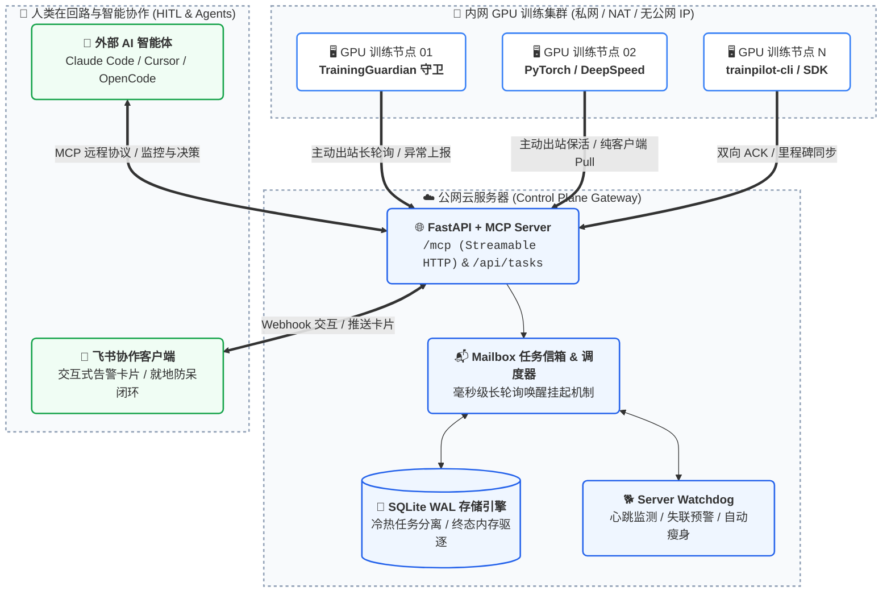
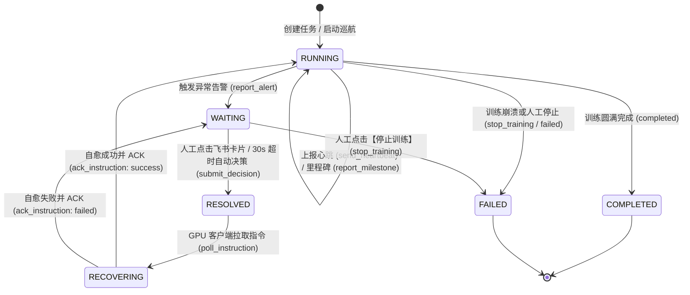

# TrainPilot: 深度学习训练集群的公网 MCP Server 与 HITL 闭环决策系统

<p align="center">
  
  
  
  
  
</p>

> 专为大规模深度学习分布式训练（PyTorch / DeepSpeed / Megatron-LM / Slurm / K8s）量身定制，采用 **“公网 MCP Server（Control Plane 网关） + 内网 GPU 客户端（Worker 主动连接 / 纯 Pull 模式）”** 的现代化解耦架构。

TrainPilot 彻底终结了内网 GPU 训练集群“无公网 IP”、“无法直接接收外网 Webhook”、“无外部凭据下发通道”与“训练异常难以及时干预”的痛点。通过标准 **Model Context Protocol (MCP)** 协议，打通训练异常捕获、现场就地冻结、飞书交互式卡片推送与**人类在回路（Human-In-The-Loop, HITL）**决策闭环，助力算法与运维团队实现秒级异常处置与智能自愈。

---

## ✨ 核心特性

- 🌐 **公网 MCP 原生驱动**：暴露标准 Streamable HTTP `/mcp` 端点，外部智能体（Claude Code、Cursor、OpenCode、Gemini CLI 等）开箱即用。
- 🪶 **内网 GPU 纯客户端**：无公网 IP、无入站端口、零外网凭据存储，训练节点作为纯客户端主动出站连接控制面。
- 🛡️ **浮点安全与就地冻结**：递归清洗 `NaN` / `Inf` 与 PyTorch Tensor / NumPy 标量，杜绝 JSON 崩溃；异常时就地冻结训练现场。
- 🔄 **双向 ACK 与自愈闭环**：严格的生命周期状态机，客户端完成自愈后携带 `solution` 上报 ACK，控制面原子流转回 `RUNNING` 并通知飞书。
- ⚡ **毫秒唤醒与单点超时**：支持长轮询挂起（空轮询减少 90%+）；告警超过 30s 无人干预由服务端统一自动决策兜底，消除分布式死锁。
- 📱 **飞书卡片就地防呆**：Webhook 秒级响应，点击后即刻将卡片更新为【已处理】状态并收起操作按钮，防范多人并发误触与重放。
- 🤖 **Agent 智能点评原生支持**：支持 AI 智能体在里程碑或异常上报时附带对收敛趋势、调参建议的 `agent_note` 自主研判分析。
- 💾 **轻量持久化与失联看门狗**：SQLite WAL 冷热内存分离（运行内存 <50MB）；Watchdog 后台线程实时侦测进程挂死与 NCCL 死锁。

---

## 🏛 系统架构与交互原理

### 网络拓扑架构



### 任务生命周期状态机



---

## 📂 项目结构

```text
TrainPilot/
├── src/trainpilot/
│   ├── server/          # 公网 MCP Server 与控制面网关 (FastAPI / 状态机 / 飞书卡片 / SQLite WAL)
│   ├── agent/           # GPU 客户端组件 (TrainingGuardian 守卫 / MCP Client / trainpilot-cli)
│   └── common/          # 核心数据契约 (Schemas) 与状态机定义 (States)
├── examples/            # 训练仿真与真实 GPU 演示范例 (mock_training.py, real_gpu_training.py)
├── Dockerfile           # 控制面容器化镜像构建规范
├── start.sh             # 服务端运维启停脚本 (--daemon / --status / --stop)
└── pyproject.toml       # 项目配置与依赖说明
```

---

## 🚀 快速上手

本项目推荐使用现代高性能 Python 包管理工具 [uv](https://docs.astral.sh/uv/)。

### 1. 安装与依赖同步

```bash
# 克隆仓库
git clone https://github.com/Long-Holiday/TrainPilot.git
cd TrainPilot

# 安装依赖
uv sync
```

### 2. 服务端一键启停 (`start.sh`)

项目根目录提供了功能齐备的运维管理脚本 [`start.sh`](file:///home/default_user/TrainPilot/start.sh)，自动处理环境检测、端口可用性排查与进程托管：

```bash
# 1. 前台交互式启动 (调试与查看实时日志)
./start.sh

# 2. 后台守护进程模式启动 (生产部署推荐)
./start.sh --daemon

# 3. 查看当前服务运行状态与健康检查探针
./start.sh --status

# 4. 优雅停止后台服务
./start.sh --stop

# 5. 自定义端口与绑定地址启动
./start.sh -p 28780 --host 0.0.0.0
```

服务启动后，终端将输出如下关键端点：
- **MCP 服务端点**: `http://<公网IP>:28780/mcp` (Streamable HTTP 传输)
- **API 交互文档**: `http://<公网IP>:28780/docs` (Swagger UI)
- **健康检查探针**: `http://<公网IP>:28780/health`
- **飞书事件回调**: `http://<公网IP>:28780/webhook/feishu`

### 3. 极速端到端模拟演练

无需真实 GPU 即可在本地完整验证 **异常告警 -> 飞书卡片 -> 人工/超时决策 -> 现场恢复 -> 闭环 ACK** 的全流程：

```bash
# 启动模拟训练（默认自动连接本地 28780 端口，模拟在第 6 步触发 NaN 并在 3 秒后闭环自愈）
uv run python examples/mock_training.py
```

---

## 🤖 客户端接入：外部 AI 智能体接入

任何支持 **Model Context Protocol (MCP)** 的现代智能体（如 Claude Code、Cursor、OpenCode、Gemini CLI 等）只需配置公网 MCP Server 地址，即可无需在本地安装任何插件或写代码，直接在自然语言对话中获得全套训练集群监控、指标研判与交互决策能力。

### MCP 客户端配置规范

采用 MCP 2.x 标准最新的 **Streamable HTTP** 传输协议，在智能体对应的配置文件中添加公网端点：

#### 1. Claude Code / Claude Desktop 配置 (`~/.claude.json` 或 `claude_desktop_config.json`)

```json
{
  "mcpServers": {
    "trainpilot": {
      "url": "http://<公网服务器IP>:28780/mcp"
    }
  }
}
```

#### 2. Cursor IDE 配置 (`.cursor/mcp.json`)

```json
{
  "mcpServers": {
    "trainpilot": {
      "url": "http://<公网服务器IP>:28780/mcp"
    }
  }
}
```

#### 3. 环境变量可选认证

若公网服务端配置了 `TRAINPILOT_API_TOKEN`，MCP 客户端可配置携带 HTTP Header：

```json
{
  "mcpServers": {
    "trainpilot": {
      "url": "http://<公网服务器IP>:28780/mcp",
      "headers": {
        "Authorization": "Bearer your_secret_token"
      }
    }
  }
}
```

---

### 常见智能体交互场景

接入后，AI 智能体将自动在其上下文工具栏中获得全部 8 项标准工具与只读资源，用户可在对话框中直接发起如下交互：

```text
💬 "帮我查看一下当前有哪些训练任务处于失联或异常状态？"
🤖 Agent 自动调用: list_tasks(stale_only=True) / list_tasks(state="WAITING")

💬 "llama3-8b-lora 任务当前进度如何？最新的 Loss 和学习率是多少？"
🤖 Agent 自动读取: tasks://status/llama3-8b-lora 或调用 get_task_status

💬 "针对正在等待决策的 qwen2-7b 任务，下发【自行解决】决策，并让节点回退上一个 Checkpoint。"
🤖 Agent 自动调用: submit_decision(task_id="qwen2-7b", action="self_resolve", operator="Claude-Code")

💬 "为 task-01 上报一个第 10000 步的里程碑，并附加你的调优点评意见。"
🤖 Agent 自动调用: report_milestone(task_id="task-01", step=10000, agent_note="梯度范数平稳收敛，未出现震荡...")
```

---

## 📡 MCP 核心接口契约

公网控制面严格遵循 MCP 规范，对外提供标准化 **Tools** 与 **Resources**。

### MCP Tools (8 大标准工具)

| 工具名称 (Tool Name) | 核心职责 | 输入参数摘要 | 输出及行为效果 |
|:---|:---|:---|:---|
| **`report_milestone`** | 监控上报 | `task_id`, `message`, `step`, `epoch`, `metrics`, `agent_note`, `extra` | 记录里程碑，更新步数与指标，向飞书推送绿色卡片及 Agent 点评 |
| **`report_alert`** | 异常拦截 | `task_id`, `message`, `step`, `epoch`, `metrics`, `agent_note`, `extra` | 状态置为 `WAITING`，冻结训练，推送红色交互卡片，激活 30s 超时定时器 |
| **`poll_instruction`** | HITL 决策拉取 | `task_id`, `wait_timeout` (默认20s), `pop` (默认True) | 挂起等待决策；决策到达时返回指令并将状态流转至 `RECOVERING` |
| **`ack_instruction`** | 自愈确认 | `task_id`, `instruction_id`, `action`, `status`, `solution`, `message` | 校验指令有效性，状态流转回 `RUNNING`，异步推送飞书【自愈恢复】卡片 |
| **`send_heartbeat`** | 节点保活 | `task_id`, `step`, `epoch`, `metrics`, `status` | 更新 `last_heartbeat_at`，重置失联预警标记，向看门狗报到 |
| **`get_task_status`** | 状态查询 | `task_id` | 获取指定任务当前生命周期状态、最新指标、信箱未决指令与事件统计 |
| **`list_tasks`** | 集群汇总 | `limit`, `offset`, `state` (状态过滤), `stale_only` (仅失联) | 分页查询集群所有跟踪任务列表，支持失联与状态过滤 |
| **`submit_decision`** | 控制台干预 | `task_id`, `action`, `payload`, `operator` | 运维人员或测试直接注入决策，更新信箱并就地将飞书卡片置为已处理 |

### MCP Resources (只读资源)

除了可调用的 Tools，TrainPilot 还向 MCP 客户端暴露如下标准资源：

| 资源 URI (Resource URI) | MIME 类型 | 功能描述 |
|:---|:---|:---|
| **`tasks://status/{task_id}`** | `application/json` | 以 JSON 格式读取指定任务的完整状态快照（包含信箱与事件统计） |
| **`tasks://list`** | `application/json` | 以 JSON 格式读取当前所有跟踪训练任务的简明摘要列表 |

---

## 📱 飞书交互卡片与 HITL 闭环体系

### 5 类卡片矩阵

TrainPilot 为深度学习生命周期的不同场景精心设计了视觉分明、结构规整的飞书卡片：

| 卡片类型 | 视觉色系 | 触发时机 | 核心内容与交互要素 |
|:---|:---:|:---|:---|
| **⚠️ 训练异常告警卡片** | 🔴 红色 Header | 触发 `report_alert` (如 Loss NaN、突增) | 实时指标、异常详情、**🤖 Agent 异常研判**、30s 倒计时说明；提供【🛑 停止训练】与【✅ 自行解决】两个交互按钮 |
| **🚀 训练里程碑卡片** | 🟢 绿色 Header | 触发 `report_milestone` (如 Epoch 完成) | 阶段进度、关键指标、**🤖 Agent 智能点评**（独立区块呈现模型调优意见） |
| **✅ 决策闭环防呆卡片** | 🟦 绿松石 Header | 用户点击决策按钮或 30s 超时触发 | 就地替换原告警卡片，展示**决策人**、**选定动作**及**闭环时间**；完全隐藏按钮防呆 |
| **🛠️ 异常自愈成功卡片** | 🟢 绿色 Header | 客户端执行自愈后发送 `ack_instruction` | 展示执行的解决方法概要（如回退 Checkpoint、调小学习率），告知团队训练已复苏 |
| **⚠️ 训练失联预警卡片** | 🟠 橙色 Header | Watchdog 检测到心跳超时（默认 >300s） | 失联时长、最后已知步数与心跳时间，提示排查硬件断电、节点崩溃或 NCCL 死锁 |

### 卡片防呆与幂等保障

1. **就地回写替换**：飞书用户在手机或 PC 端点击按钮后，服务端响应中直接携带 `type: "raw"` 的新卡片，飞书客户端 3 秒内将原告警卡片更新为【决策已闭环】，彻底移除操作按钮，防止并发环境下多人重复点击。
2. **状态机强锁保护**：即使网络抖动产生重放请求，一旦任务脱离 `WAITING` 状态，控制面将拒绝后续的重复决策；客户端 ACK 时也必须携带匹配的 `instruction_id`。

### 飞书自建应用配置流程

如需启用真实的飞书卡片推送与交互，只需在[飞书开放平台](https://open.feishu.cn/)创建企业自建应用：

1. **凭证获取**：进入应用详情页，在【凭证与基础信息】中获取 `App ID` 和 `App Secret`。
2. **事件订阅与回调配置**：
   - 请求网址 URL 填写：`http://<公网服务器IP>:28780/webhook/feishu`
   - 获取并配置 `Verification Token` 与 `Encrypt Key`（可选）。
3. **卡片行为回调配置**：
   - 在【应用功能】->【机器人】中启用机器人能力。
   - 在【消息与群组】或卡片交互配置中，将消息卡片交互回调 URL 同样配置为 `http://<公网服务器IP>:28780/webhook/feishu`。
4. **权限范围 (Scope)**：
   - 勾选 `im:message`（获取与发送单聊/群聊消息）相关读写权限。
5. **获取接收目标 ID**：
   - 群聊推送：将机器人拉入训练监控群，在群设置中获取 `chat_id`（如 `oc_xxxx`）。
   - 个人推送：获取用户的 `open_id`（如 `ou_xxxx`）。

> [!NOTE]
> 若尚未配置飞书应用，系统默认开启安全 Mock 模式：所有卡片均会在服务端控制台以格式化日志完整打印，绝不阻断训练流程。

---

## ⚙️ 部署与环境配置速查

### 启动脚本高级参数

[`start.sh`](file:///home/default_user/TrainPilot/start.sh) 提供了完善的命令行参数：

```text
用法: ./start.sh [选项]

选项:
  (无参数)                 前台交互式启动控制面网关 (默认)
  --daemon, -d             后台守护进程模式启动 (通过 nohup/setsid 托管)
  --stop                   优雅停止运行中的后台网关进程
  --status                 检查服务存活状态并调用 /health 探针
  --port, -p <PORT>        临时指定监听端口 (默认: 28780)
  --host, --bind, -H <IP>  临时指定绑定网卡地址 (默认: 0.0.0.0)
  --help, -h               查看帮助信息
```

### Docker 容器化部署

本项目提供了优化的多阶段轻量 Dockerfile（基于 `python:3.11-slim` 与 `uv`）：

```bash
# 1. 构建镜像
docker build -t trainpilot:latest .

# 2. 运行容器 (映射 28780 端口，挂载持久化数据库与配置文件)
docker run -d \
  --name trainpilot-gateway \
  -p 28780:28780 \
  -v $(pwd)/trainpilot.db:/app/trainpilot.db \
  -v $(pwd)/.env:/app/.env:ro \
  --restart always \
  trainpilot:latest
```

> [!WARNING]
> **关于并发 Worker 的重要说明**：由于控制面内部维护了内存信箱调度器与毫秒级长轮询事件挂起机制，Uvicorn **必须以单 Worker 模式运行**（`--workers 1`）。切勿使用多 Worker 进程，否则跨进程将无法共享长轮询等待锁。如需水平扩展，请通过统一网关反向代理并基于 `task_id` 实现哈希路由。

### 环境变量完全参考表

复制并编辑配置文件：`cp .env.example .env`

#### 模块一：公网服务端配置 (运行在公网服务器)

| 环境变量名 | 默认值 | 类型 | 配置说明 |
|:---|:---|:---:|:---|
| `TRAINPILOT_PORT` | `28780` | int | 服务端监听端口（采用高位端口规避冲突） |
| `TRAINPILOT_BIND_HOST` | `0.0.0.0` | str | 服务端绑定网卡地址（优先使用） |
| `TRAINPILOT_DEBUG` | `false` | bool | 是否启用调试级别日志 |
| `TRAINPILOT_FEISHU_APP_ID` | - | str | 飞书应用凭据 App ID (`cli_xxxx`) |
| `TRAINPILOT_FEISHU_APP_SECRET` | - | str | 飞书应用凭据 App Secret |
| `TRAINPILOT_FEISHU_VERIFICATION_TOKEN` | - | str | 飞书 Webhook 事件校验 Token |
| `TRAINPILOT_FEISHU_ENCRYPT_KEY` | - | str | 飞书 Webhook 消息加密密钥（可选） |
| `TRAINPILOT_FEISHU_RECEIVE_ID_TYPE` | `chat_id` | str | 接收者类型 (`chat_id`, `open_id`, `user_id`, `email`) |
| `TRAINPILOT_FEISHU_RECEIVER_ID` | - | str | 接收者 ID（群聊 `oc_xxxx` 或个人 `ou_xxxx`） |
| `TRAINPILOT_ENABLE_MOCK_FEISHU` | `false` | bool | 强制启用飞书 Mock 模式（测试与本地演练用） |
| `TRAINPILOT_API_TOKEN` | - | str | API 鉴权令牌（设置后客户端调用须携带此 Token） |
| `TRAINPILOT_ALERT_DECISION_TIMEOUT_SECONDS`| `30` | int | 告警卡片等待人工决策超时时间（秒），超时自动自愈 |
| `TRAINPILOT_TASK_HEARTBEAT_TIMEOUT_SECONDS`| `300` | int | 任务心跳判定失联阈值（秒） |
| `TRAINPILOT_LONG_POLL_TIMEOUT_SECONDS` | `20.0` | float | 服务端长轮询最大挂起时长（秒） |
| `TRAINPILOT_ENABLE_SQLITE` | `true` | bool | 是否启用 SQLite WAL 本地持久化 |
| `TRAINPILOT_SQLITE_PATH` | `trainpilot.db` | str | SQLite 数据库存储路径 |
| `TRAINPILOT_MAX_EVENTS_PER_TASK` | `500` | int | 每个任务保留的最大历史事件数量（环形修剪） |
| `TRAINPILOT_ENABLE_WATCHDOG` | `true` | bool | 是否启用服务端失联看门狗守护线程 |
| `TRAINPILOT_WATCHDOG_INTERVAL_SECONDS` | `15` | int | 看门狗后台扫描周期（秒） |
| `TRAINPILOT_MCP_ENABLE_DNS_REBINDING_PROTECTION` | `false` | bool | 是否启用 MCP DNS 重绑定防护（跨公网连接设为 false） |

#### 模块二：内网 GPU 客户端配置 (运行在 GPU 训练节点)

| 环境变量名 | 示例值 | 配置说明 |
|:---|:---|:---|
| `TRAINPILOT_GATEWAY_URL` | `http://1.2.3.4:28780` | 公网控制面完整 URL（优先级最高，注意**切勿配置为 0.0.0.0**） |
| `TRAINPILOT_HOST` | `1.2.3.4` | 公网控制面 IP 或域名（与 `TRAINPILOT_PORT` 拼接生效） |
| `TRAINPILOT_PORT` | `28780` | 公网控制面监听端口 |
| `TRAINPILOT_TASK_ID` | `llama3-8b-lora` | 当前训练任务的唯一标识字符串 |
| `TRAINPILOT_API_TOKEN` | - | 与服务端一致的访问鉴权 Token |

---

## 📄 开源协议

本项目采用 [MIT License](https://opensource.org/licenses/MIT) 开源许可证。欢迎提交 Issue 与 Pull Request 共同改进！
